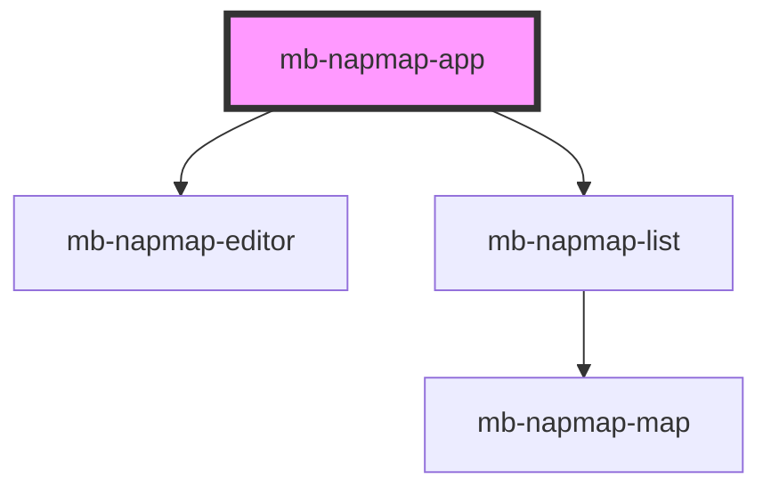

# mb-napmap-app

<!-- Auto Generated Below -->

## Properties

| Property   | Attribute   | Description | Type     | Default     |
| ---------- | ----------- | ----------- | -------- | ----------- |
| `apiBase`  | `api-base`  |             | `string` | `undefined` |
| `basePath` | `base-path` |             | `string` | `""`        |

## Dependencies

### Depends on

- [mb-napmap-editor](../mb-napmap-editor)
- [mb-napmap-list](../mb-napmap-list)

### Graph

----------------------------------------------

*Built with [StencilJS](https://stenciljs.com/)*
