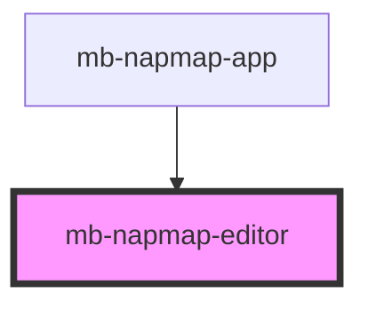

# mb-napmap-editor

<!-- Auto Generated Below -->

## Properties

| Property    | Attribute    | Description | Type     | Default     |
| ----------- | ------------ | ----------- | -------- | ----------- |
| `apiBase`   | `api-base`   |             | `string` | `undefined` |
| `stationId` | `station-id` |             | `string` | `undefined` |

## Events

| Event           | Description | Type                  |
| --------------- | ----------- | --------------------- |
| `editor-closed` |             | `CustomEvent<string>` |

## Dependencies

### Used by

 - [mb-napmap-app](../mb-napmap-app)

### Graph

----------------------------------------------

*Built with [StencilJS](https://stenciljs.com/)*
