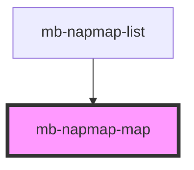

# mb-napmap-map

<!-- Auto Generated Below -->

## Properties

| Property   | Attribute | Description | Type        | Default |
| ---------- | --------- | ----------- | ----------- | ------- |
| `stations` | --        |             | `Station[]` | `[]`    |

## Events

| Event             | Description | Type                  |
| ----------------- | ----------- | --------------------- |
| `station-clicked` |             | `CustomEvent<string>` |

## Dependencies

### Used by

 - [mb-napmap-list](../mb-napmap-list)

### Graph

----------------------------------------------

*Built with [StencilJS](https://stenciljs.com/)*
